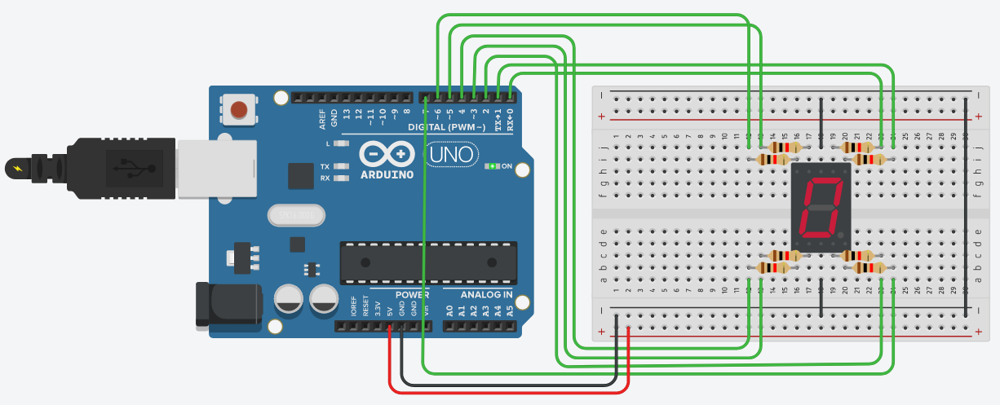
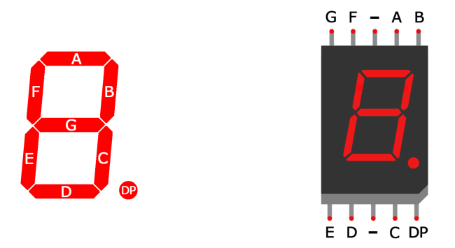

# Ejercicios de E/S digitales del $`\mu`$C ATmega328

Gonzalo F. Perez Paina

## Ejercicicios

1. La siguiente figura muestra la conexión entre la placa Arduino UNO y un display de 7 segmentos:
    

      
       Circuito con display de 7 segmentos.
    

    El display de 7 segmentos consiste de 7 diodos emisores de luz o LEDs (Light Emmited Diode) llamados segmentos dispuestos para formar el número ocho. La mayoría de estos display tienen en realidad un total de 8 LEDs: 7 que forman el número y 1 para el punto decimal. Cada segmento se designa con la letra desde la A hasta la G, y DP para el punto. Existe dos tipos de display de 7 segmentos: de ánodo común y de cátodo común.
    

      
       Posición de segmentos y pines de conexión para cátodo común.
    

    
    El sketch [`Display7segCounter.ino`](../src/arduino/sketch/Display7segCounter/Display7segCounter.ino) muestra un programa Arduino que implementa un contador decimal (de 0 a 9) en el display de 7 segmentos del circuito anterior.

    En base a dicho circuito y al sketch de ejemplo, escribir un programa en lenguaje C con la misma funcionalidad del sketch antes mencionado, donde el módulo GPIO se programe mediante el acceso a los registros del $`\mu`$C.

1. Agregar un pulsador al circuito con el display de 7 segmentos conectado a una entrada digital del $`\mu`$C, por ejemplo `PB0`. Luego, modificar el programa del ejercicio anterior de forma tal que el valor mostrado en el display de 7 segmentos incremente su valor al presionar el pulsador en lugar de hacerlo de forma automática cada 1 seg. En el proceso de lectura de la entrada digital, el programa debe determinar si cambió de estado y si el nuevo estado se corresponde al pulsador presionado. Además analice:
    1. ¿Qué sucede si se mantiene presionado el pulsador?
    1. ¿Cómo debería modificarse el programa para que la cuenta se incremente si se mantiene presionado el pulsador?

1. Agregar un interruptor al circuito del ejercicio anterior conectado a una entrada digital (por ejemplo `PB1`) y modificar el programa para que el número mostrado en el display cambie al presionar el pulsador, incrementando o decrementando el valor según el estado del interruptor.

1. En el circuito con el display de 7 segmentos, las salidas digitales conectadas a los segmentos A y B se corresponden con los pines 0 y 1 de la placa Arduino UNO, o sea, los bits `PD0` y `PD1` del Puerto D. Estos dos bits comparten la funcionalidad con los bits de transmisión (`Tx`) y recepción (`Rx`) del puerto serie del $`\mu`$C ATmega328. Para poder utilizar el display de 7 segmentos en conjunto con el puerto serie se pide:
    1. Modificar el circuito de forma tal que los segmentos A y B pasen a estar conectados a las salidas digitales `PB0` y `PB1` respectivamente. O sea, cambiar `PD0` por `PB0` y `PD1` por `PB1`.
    1. Modificar el programa del contador decimal para adecuarlo al nuevo circuito.

1. Escribir un programa en lenguaje C con la misma funcionalidad del sketch [`ToggleLEDSerial.ino`](https://github.com/ciiiutnfrc/ponchitoCIII/blob/master/sketch/ToggleLEDSerial/ToggleLEDSerial.ino), donde el módulo GPIO se programe mediante el acceso a los registros del $`\mu`$C ATmega328.

1. Escribir un programa en lenguaje C con la misma funcionalidad del sketch [`ButtonStateSerialBin.ino`](https://github.com/ciiiutnfrc/ponchitoCIII/blob/master/sketch/ButtonStateSerialBin/ButtonStateSerialBin.ino), donde el módulo GPIO se programe mediante el acceso a los registros del $`\mu`$C ATmega328.

