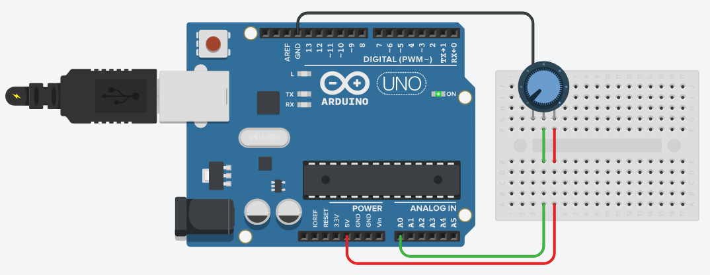

# Ejemplo de comunicación Arduino->PC

En los siguientes ejemplos se utiliza el circuito mostrado a continuación, en el cual se contecta un potenciómetro a la entrada analógica `A0` (correspondiente con el canal 0 del conversor analógico o ADC -Analog to Digital Converter). Este circuito es parte de [`ponchitoCIII`](https://github.com/ciiiutnfrc/ponchitoCIII).

<div align="center">
  
  <br>Conexión de potenciómetro a entrada analógica de la placa Arduino UNO.
</div>

<br>El ADC del $\mu$C ATmega328 es de 10 bits, por lo que el rango de valores del conversor es de 0 a 1023 ($2^{10}=1024$). 

Los siguientes ejemplos están basados en el sketch `AnalogReadSerial` incluido con el IDE Arduino (ver [documentación de Arduino](https://docs.arduino.cc/built-in-examples/basics/AnalogReadSerial/)).

## Ejemplo 1: Lectura de 1 único byte
### Programa para el Arduino
El sketch a utilizar es [`AnalogReadSerialByte.ino`](../src/arduino/sketch/AnalogReadSerialByte/AnalogReadSerialByte.ino). Este programa toma el valor leído desde el ADC como variable entera en el rango 0-1023 lo escala al rango 0.255 y almacena en una variable de 1 único byte; el cual se envía por el puerto serie a la PC.

### Programa para la PC
El archivo [`read_byte.c`](../src/pc/c/read_byte.c) se corresponde al código fuente de un programa que recibe un byte por puerto serie y muestra su valor en la salida estándar como número entero (con valor entre 0 y 255).

El programa recibe mediante argumentos de la función `main()` el puerto serie y la velocidad de comunicación a utilizar. El mismo se puede compilar con:
```
$> gcc -Wall read_byte.c termset.c -o read_byte
```
generando el binario `read_byte`, el cual se debe ejecutar con:
```
$> ./read_byte /dev/ttyUSB0 9600
```
(se debe cambiar `/dev/ttyUSB0` por el archivo creado al conectar la placa Arduino)

## Ejemplo 2: Lectura de cadena de longitud variable
### Programa para el Arduino
En este ejemplo se utiliza el sketch original incluido con el IDE Arduino (`AnalogReadSerial`). Este sketch envía el valor del ADC como cadena (arreglo de caracteres más fin de cadena), la cual representa un valor entero en el rango de valores de 0 a 1023, dado que el ADC del $\mu$C es de 10 bits.

Un aspecto importante es que la cadena enviada es de longitud variable, dependiendo del número entero que representa, por ejemplo: `"0"`, `"518"`, `"1023"`, etc.

### Programa para la PC
El archivo [`read_line.c`](../src/pc/c/read_line.c) muestra un código fuente de ejemplo de una aplicación de PC para leer el puerto serie mediante funciones de alto nivel de manejo de archivos. Se utiliza la función `getline()` debido a que la cadena es de longitud variable. Cabe aclarar que si la cadena fuera de longitud fija se podría utilizar la función de lectura de bajo nivel `read()` indicando la cantidad de bytes a leer.

El programa recibe mediante argumentos de la función `main()` el puerto serie y la velocidad de comunicación a utilizar. El mismo se puede compilar con:
```
$> gcc -Wall read_line.c termset.c -o read_line
```
generando el binario `read_line`, el cual se debe ejecutar con:
```
$> ./read_line /dev/ttyUSB0 9600
```
(se debe cambiar `/dev/ttyUSB0` por el archivo creado al conectar la placa Arduino)
