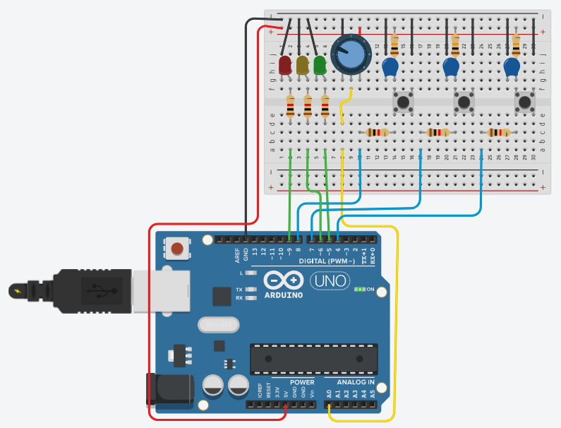

# Ejemplo de comunicación PC->Arduino

A continuación se muestra el circuito a utilizar (corresponde al [`ponchitoCIII`](https://github.com/ciiiutnfrc/ponchitoCIII)) en este ejemplo:

<div align="center">
  
  <br>Conexión de placa Arduino UNO con ponchitoCIII.
</div>

<br>Se utilizan los LEDs conectados al Arduino:
* LED verde conectado al `PIN 5`
* LED amarillo conectado al `PIN 6`
* LED rojo conectado al `PIN 9`

## Programa para el Arduino
El código fuente del sketch Arduino es [`ToggleLEDSerial.ino`](https://github.com/ciiiutnfrc/ponchitoCIII/blob/master/sketch/ToggleLEDSerial/ToggleLEDSerial.ino) de [`ponchitoCIII`](https://github.com/ciiiutnfrc/ponchitoCIII). Este programa permite cambiar el estado del LED al recibir un caracter `v`, `a` o `r` por el puerto serie enviado desde la PC.

Desde el punto de vista de la placa Arduino, al recibir la lectra `v` se conmuta el estado del LED verde, la letra `a` para el LED amarillo y la letra `r` para el LED rojo. El programa se puede probar utilizando el _"Monitor Serie"_ del IDE Arduino o bien se puede escribir un programa de PC para tal fin.
 
## Programa para la PC
El archivo [`write_char.c`](../src/pc/c/write_char.c) se corresponde al código fuente de un programa que envía el caracter `v` por el puerto serie, que al ejecutar desde la PC conectada a la placa Arduino UNO y con el sketch anterior grabado, hace que el LED verde se encienda y apague cada un segundo aproximadamente.

El programa recibe mediante argumentos de la función `main()` el puerto serie y la velocidad de comunicación a utilizar. El mismo se puede compilar con:
```
$> gcc -Wall write_char.c termset.c -o write_char
```
el cual utiliza también el código fuente del módulo de configuración de puerto serie [`termset`](../src/pc/c/termset).

Luego, se debe ejecutar con:
```
$> ./write_char /dev/ttyUSB0 9600
```
(se debe cambiar `/dev/ttyUSB0` por el archivo creado al conectar la placa Arduino)
